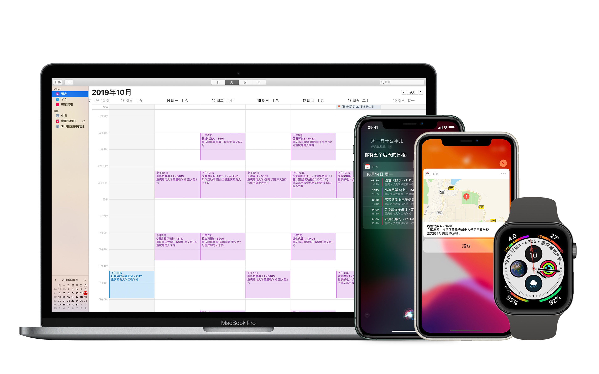

# Python 大学生课表 iCalendar (.ics) 生成



## 简介

大一新生第一次接触大学生课表，在有 Mac、iPhone 和 Apple Watch 设备的情况下希望能将自己的课表导入内置日历应用，以更方便的随时查看课表和规划行程。由于没有找到比较合适的 app 故自己写了这一代码。

大多数代码兼容 Python 2，使用 Python 2 需要添加 UTF-8 注释，并修改部分代码。推荐使用 Python 3 运行。

## 功能
* 支持录入课程名称，教师，必修/选修，学分，上课地点，星期几，周数和第几节课及一个附加信息

* 支持**单独周数，范围周数，奇偶周数**，如 "**第2周，5-11单数周，13-17 周**"

* 支持 **Apple Maps GPS** 信息（需手动补充，后续说明），在日历中添加教室位置，并可利用 iOS 的 Siri 分析功能在多个 App 中获得附加功能

* 你可以获得 Apple 软件中的特别功能：例如向 Siri 问：我今天有什么事情？我下周五有什么安排？例如在 Apple Watch 表盘上获得下节课的时间和地点…… 添加 GPS 信息后，你还可以获得 Apple Maps 出发时间提醒，Siri 与搜索自动联想等功能。

## 使用
请调整代码中的以下内容以适配自己的课表：

1. **maxWeek** 为本学期最大周数，有 20 周即写 20 周，为了方便后续代码将自动 +1，也可以去掉代码中的 `maxWeek += 1`，然后填写已经 + 1 后的周数。

2. **classTime** 为每节课的上课时间，以元组形保存。为了方便后续第 n 节课直接为`[n]`，预留了第 0 项为`None`，可以不做修改。直接填写每节课的 24 小时制上课时间：例如 8:00 上课，则录入`(8, 0)`；下午 7:50 上课，则录入`(19, 50)`。

3. 修改 **starterDay** 为本学期第一周星期一的日期。

4. 修改 **classes** 中的课程信息，由于不同学校课表可能含有不同信息，请参考源代码中的课表填写，并直接在后续定义中作出相应修改：<br><br>
在 `for Class in classes:` 后，定义了不同的变量，均可进行自定义。最终，`Title`变量为日历项的标题，`Description`变量为日历项的备注，均可根据自己喜好修改。您只需要一点点 Python 基础即可看懂源代码并作出修改。<br><br>
**如何设置周数？**
单独周：请改为数组形式，例如 [2]；
范围周：请使用`rgWeek`，例如 rgWeek(3, 7) 代表第三周到第七周；
奇数周：请使用`oeWeek`，例如 oeWeek(2, 9, 1) 代表第二周到第九周的单数周，将 1 改为 0 即为偶数周。<br><br>
**如何设置课程节数？**
一节课：请改为数组形式，例如 [2]；
范围课，请使用`rgWeek`，例如 rgWeek(3, 7) 代表第三节一直上到第七节；<br><br>
周数，节数如有多项组成，请使用加法。例如，第2周，5-11单数周，13-17 周，则为：
```python
[2] + oeWeek(5, 11, 1) + rgWeek(13, 17)
```

5. 在`classEndTime.append`行末尾将 "+ 45" 修改为加每节课的时长，一节课 40 分钟则为 "+ 40"。

6. 更改 jWrite 中的文件目录为合适的位置以便输出最终结果

库中的 timetable_cqupt.py 是重庆邮电大学同学的一个版本，timetable_cqu.py 是重庆大学同学的一个版本，供你参考两种不同的 classes 和 Class 的变量内容。

## 关于 GPS 位置

这一功能**仅在 Apple 设备上进行测试**，在 iCalendar 标准中，似乎定义 GEO 并输入坐标即可确定位置，但在 iOS 和 macOS 上验证不通过。

Apple 日历使用了`X-APPLE-STRUCTURED-LOCATION`，`X-APPLE-MAPKIT-HANDLE`来记录 Apple Maps 位置信息，这一项包含位置文字和坐标。一个样例内容如下:

    LOCATION:重庆邮电大学综合实验大楼\n南山路新力村
    X-APPLE-STRUCTURED-LOCATION;VALUE=URI;X-APPLE-MAPKIT-HANDLE=;X-APPLE-RADIUS=500;X-TITLE=重庆邮电大学综合实验大楼\\n南山路新力村:geo:29.524289,106.605595

其中，`LOCATION`和`X-TITLE`中的地址必须**一字不差**的和 Apple Maps 结果对应，不得修改。geo 项则为坐标。

为了保证可用性，这一段文本只能手动创建日历项并导出提取。如果您没有 iOS/macOS 设备，或您不需要 GPS 这一功能，可以直接跳过。

### 导出方法

1. 打开 macOS 日历 app，创建一个空白日历项（请尽量在一个没有太多日历项的日历中创建，因为稍后需要导出整个日历），并输入想要添加的位置保存。

2. 点击日历 -> 文件 -> 导出 -> 导出，保存 ics 文件。

3. 用文本编辑器打开 ics 文件，找到`BEGIN:VEVENT`中你刚刚建立的包含位置的 VEVENT 项目。

4. 你将可找到类似以下两个文段：

```
LOCATION:重庆大学虎溪校区\n大学城南路55号    
X-APPLE-STRUCTURED-LOCATION;VALUE=URI;X-APPLE-MAPKITHANDLE=一大串文字;X-APPLE-RADIUS=925.4324489259043;X-TITLE=重庆大学虎溪校区\\n大学城南路5号:geo:29.592566,106.299150
```

直接将 <一大串文字> 全部去掉，注意不要删除后面的分号，RADIUS 可以不修改，TITLE 中的文字请勿修改。

最后，将这一段文字替换代码中的 customGEO（代码中有重庆大学虎溪校区和重庆邮电大学部分楼栋信息作为参考，你也可以以这样的方式处理不同的教学楼）。注意在 Python 文段中保留 \n 需要多加一个斜线，保留双斜线 n 则需要四斜线。

## 联系作者
* 直接提交 Issue

* Telegram [@marvin_lou](http://t.me/marvin_lou "@marvin_lou")

* 微博 [@赛艇的同学](http://weibo.com/n/赛艇的同学 "@赛艇的同学")

2019/9/7 @重庆邮电大学国际学院
