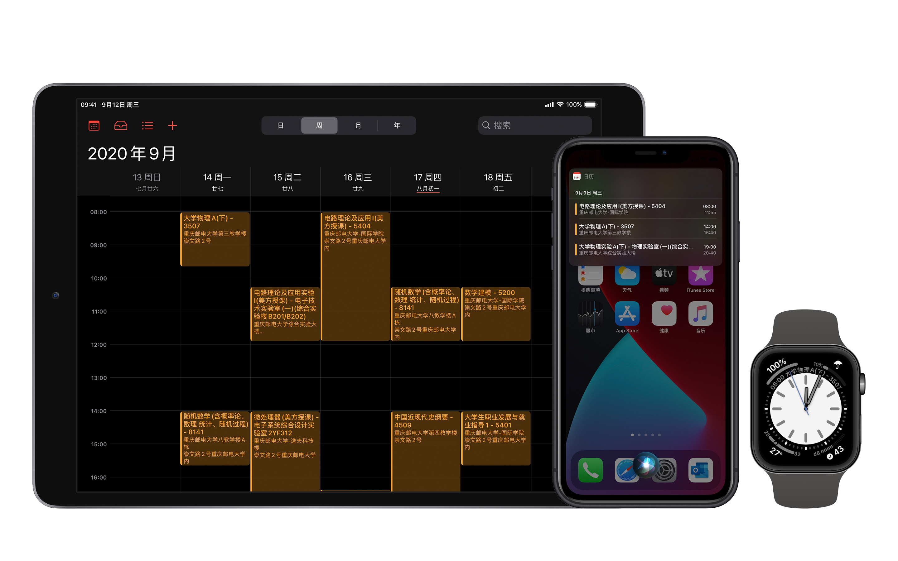
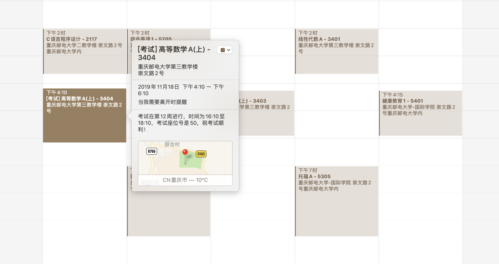

# Python 大学生课表 iCalendar (.ics) 生成



## 简介

如果你有 iPhone、iPad 或 Apple Watch，Apple 日历的体验实际上是相当舒适的，当然诸多日历 app 如 Google Calendar 也是如此。不过，并非所有学校都为学生提供 ics 日历，因此本代码旨在用 Python 3 协助你创建一个自己的 ics 日历课表。

#### 在此之前，如果你是重庆邮电大学学生…



恭喜你！你可以直接使用 **timetable_cqupt_automatic.py**，就可以**自动获取并生成来自教务在线的课表和考试安排**。

你可以通过使用 Linux 计划任务自动运行本代码，刷新课表文件，在手机端配置 ics 订阅，这样即可获得最新的、包含调停课（仅限教务备案的）的课表和考试安排。**直接修改代码顶部中的学号和末尾 ics 的生成位置即可**。

课表和考试安排数据由重庆邮电大学红岩网校所开发掌上重邮 app (cyxbsmobile) 提供。

## 功能
* 支持录入各种信息，示例代码中包含：课程名称，教师，必修/选修，学分，上课地点等
* 支持多种课程时间安排：**单独的周数，范围的周数，奇偶周数**，如 "**第2周，5 至 11 周中的单数周，13 至 17 周**"
* 支持 **Apple Maps 定位** 信息（需手动补充，后续说明），在日历项中添加教室位置，就可利用 iOS 的 Siri 分析功能在多个 app 中获得附加功能
* 导入到 iOS、iPadOS 系统后，你可以享受 Apple 软件中的各种日历功能：例如向 Siri 问「我今天有什么事情？」「我下周五有什么安排？」，例如在 Apple Watch 表盘上获得下节课的时间和地点，例如通过编写 Siri Shortcut 实现更多自动化；添加 GPS 信息后，你还可以获得 Apple Maps 提供的出发时间和交通方式建议，Siri 与搜索联想等功能。

## 使用
请调整代码中的以下内容以适配自己的课表：

1. 在代码前端的 `for i in range(1, 30):` 中，30 表示将会预生成的日历周数，如果很不幸你这学期有超过 30 周的课，应该修改 30 为最大周数 + 1（此数字也可设置的更大）。

2. **classTime** 为每节课的**上课**时间，以元组形保存。预留第 [0] 项为 None 是为了让后续读取第 1 节课时可以按照常规思路取第 [1] 项，而非第 [0] 项。请依次填写每节课的 24 小时制上课时间：例如 8:00 上课，则录入 `(8, 0)`；下午 7:50 上课，则录入 `(19, 50)`。

3. 修改 **starterDay** 为本学期第一周星期一的日期。

4. 修改 **classes** 中的课程信息，由于不同学校课表可能含有不同信息，请参考源代码中的课表填写，并直接在后续定义中作出相应修改：

  在 `for Class in classes:` 后，定义了不同的变量，均可进行自定义。最终，「**Title**」变量为日历项的标题，「**Description**」变量为日历项的备注，均可根据自己喜好修改。

  代码中给出的「**Title**」是类似「高等数学 - 5200」的样式，「**Description**」则包括该课程的一些其他信息，如教学班号、教师姓名、学分、必修/选修等。
  
  **如何设置课程在哪一周？**
  单独周：请改为数组形式，例如 [2]；
范围周：你可以使用 `rgWeek` 函数，例如 `rgWeek(3, 7)` 代表第三周到第七周；
  奇数周：你可以使用 `oeWeek` 函数，例如 `oeWeek(2, 9, 1)` 代表第二周到第九周的单数周，将 1 改为 0 即为偶数周。
  
  **如何设置课程在哪一节？**
一节课：请改为数组形式，例如 [2]；
  范围课，你可以使用 `rgWeek` 函数，例如 `rgWeek(3, 7)` 代表第三节一直上到第七节；
  
  当然，在任意时候你都可以直接用数组列举出所有的值，例如 `[2, 3, 5, 7, 10, 12, 16]`。
  
  如果周数、节数是由多项组成，请使用加法。例如，第2周，5-11单数周，13-17 周，则为：
```python
[2] + oeWeek(5, 11, 1) + rgWeek(13, 17)
```

5. 在 `classEndTime.append` 行末尾将 `+ 45` 修改为加每节课的时长，一节课 40 分钟则为 `+ 40`。


库中的 **timetable_cqupt.py** 是重庆邮电大学同学的一个版本，**timetable_cqu.py** 是重庆大学同学的一个版本，供你参考两种不同的 classes 和 Class 变量内容。

## 添加 Apple Maps GEO

**代码中的定位功能仅在 Apple 设备上进行测试**。

实际上，在 iCalendar 标准中，只需要定义一个 GEO 项并输入坐标就可以确定位置，但在 iOS 和 macOS 上验证不通过。

Apple 日历使用了「X-APPLE-STRUCTURED-LOCATION」和「X-APPLE-MAPKIT-HANDLE」来记录 Apple Maps 位置信息，这一项包含位置文字和坐标。一个样例内容如下:

```c++
LOCATION:重庆邮电大学综合实验大楼\n南山路新力村
X-APPLE-STRUCTURED-LOCATION;VALUE=URI;X-APPLE-MAPKIT-HANDLE=;X-APPLE-RADIUS=500;X-TITLE=重庆邮电大学综合实验大楼\\n南山路新力村:geo:29.524289,106.605595
```

其中，`LOCATION `和 `X-TITLE` 中的地址必须**一字不差**的和 Apple Maps 结果对应，不得修改。geo 项则为坐标。

为了保证可用性，这一段文本只能手动创建日历项并导出提取。

### 导出方法

1. 打开 macOS 日历 app，任意创建一个日历项，添加你想要用在代码中的地理位置。

2. 请确定刚刚创建的日历项在哪一个日历里，然后点击 macOS 工具栏中的 文件 -> 导出 -> 导出，保存 ics 文件。

3. 用文本编辑器打开 ics 文件，找到一个由 `BEGIN:VEVENT` 开头的你刚刚建立的包含位置的 VEVENT 项目。

4. 你将可找到类似以下两个文段：

```c++
LOCATION:重庆大学虎溪校区\n大学城南路55号    
X-APPLE-STRUCTURED-LOCATION;VALUE=URI;X-APPLE-MAPKITHANDLE=1234567890ABCDEFGHIJ;X-APPLE-RADIUS=925.4324489259043;X-TITLE=重庆大学虎溪校区\\n大学城南路5号:geo:29.592566,106.299150
```

这里「X-APPLE-MAPKITHANLE」中的「1234567890ABCDEFGHIJ」是一串随机文字，可以全部去掉（注意不要删除后面的分号），「RADIUS」没有必要修改但可以稍改，而「TITLE」中的文字务必不要修改！

将这一段文字替换代码中的 customGEO（本库提供了重庆大学虎溪校区、重庆邮电大学部分教学楼的 GEO 信息作为参考）。注意在 Python 文段中要保留「\n」需使用「\\\\n」，类似的，保留「\\\\n」需要「\\\\\\\\n」。

## 联系作者
* 直接提交 Issue
* Telegram [@shunitsu](http://t.me/shunitsu "@shunitsu")
* 微博 [@除不尽的都](http://weibo.com/u/3566216663 "@除不尽的都")

